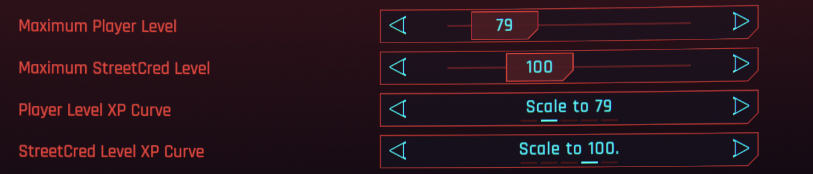
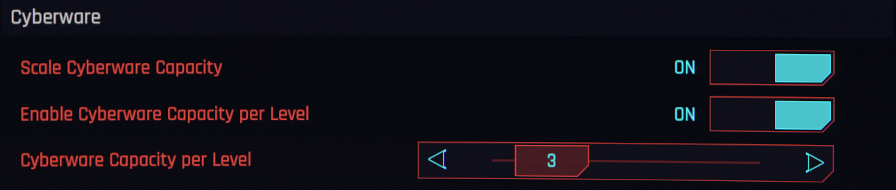

# More Levels

Increase the maximum player and street cred level, and alter the rate at which you earn XP. Cyberware capacity can scale with the increased level.

## Prerequisites

Mandatory and optional requirements for use of this mod.

- [Redscript 0.5](https://www.nexusmods.com/cyberpunk2077/mods/1511)
- [TweakXL 1.11](https://www.nexusmods.com/cyberpunk2077/mods/4197)
- [Codeware 1.17](https://www.nexusmods.com/cyberpunk2077/mods/7780)
- [ArchiveXL 1.24](https://www.nexusmods.com/cyberpunk2077/mods/4198)
- [Mod Settings 0.2.21](https://www.nexusmods.com/cyberpunk2077/mods/4885) (Optional)

## Installation

1. Download and install the required prerequisites.
2. Download the latest version of this mod through [NexusMods](https://www.nexusmods.com/cyberpunk2077/mods/22768?tab=files) or [GitHub](https://github.com/Dunc4nNT/cyberpunk-2077-modding/releases)
3. Unzip the downloaded file into your `Cyberpunk 2077` directory.
4. Launch the game.

## Compatibility

This mod is compatible with Cyberpunk 2077 version 2.3 and 2.21.

## Configuration

You can configure the max player level in the "Mod Settings" menu. By default this mod sets it to 79, which allows you to max out all attributes. You could also increase it up to 200, allowing you unlock and max out every perk as well. There is a toggle for cyberware capacity scaling, which allows a cyberware capacity past the standard 500 limit, as you gain 3 per level, you can go past 500. You're also able to configure the amount with which cyberware capacity increases each level.

Besides player level, you can also configure a maximum street cred level, up to 200. This doesn't give any extra rewards, it's just "number go up :)".

The game's XP curve stops at level 60, by default this mod extends the curve up to level 79. This can be toggled back to the vanilla curve in the settings menu.

There are also various XP multiplier sliders, for character level, streetcred, and all the various skill types.

## How to Use

Once you open the game for the first time, click on "Mod Settings" in the main menu and configure the mod however you like. You can then just load your save and play the game normally.

## Limitations

For nearly all scenarios you're fine to edit settings while playing, but there is one case which may require you to restart your game for it to update. If you update cyberware capacity or cyberware capacity per level, you might need to reload your save or restart your game for the change to take effect. This is really a non-issue as you likely naturally restart multiple times before passing the cap, but it is something to keep in mind.

If you know how to fix this so it no longer requires a restart, please let me know (or create a PR on the [repo](https://github.com/Dunc4nNT/cyberpunk-2077-modding)) and I'll fix it in a future update!

## Translations

Although I only provide English localisation with the mod, and I do not accept translations into my mod releases, you're free to distribute your own. On the modding wiki you can find an [extensive guide to translating mods](https://wiki.redmodding.org/cyberpunk-2077-modding/modding-guides/everything-else/how-to-translate-a-mod). You can get the localisation file from `archive\pc\mod\MoreLevels.archive`. Once you have your distribution files (a `.archive` and `.archive.xl` file), you can create a translation mod on NexusMods and link MoreLevels as the mod you've translated.
